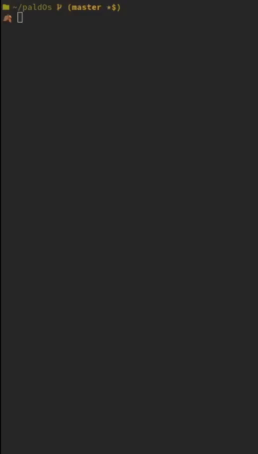

# paldOS

paldOS is an operating system based on Nachos.



## Nachos
**Not Another Completely Heuristic Operating System**, or **Nachos**, is instructional software for teaching undergraduate, and potentially graduate level operating systems courses. It was developed at the University of California, Berkeley, designed by Thomas Anderson, and is used by numerous schools around the world.

## What paldOs offer:
### Thread managment and concurrency
Starting from semaphores provided by Nachos we implemented other tools for thread managment and concurrency.
- Locks
- Condition variables
- Channels

### Virtual memory
We implemented some virtual memory upgrades:
- TLB
- Demand Loading
- Swap
- Page Replacement Policy: LRU, FIFO

### Scheduler
- Multilevel priority queue

### Filesystem
Nachos provides a very limited file system and we build around that a lot of nice features:
- Larger and extensible files (up to the disk space)
- Directory hierarchy

### Userland
Some of the programs that you can run as an user are:
- ls
- cd
- touch
- cp
- mkdir
- rm
- rmdir
- cat
- echo
- cat>
- exit
- help

> Note: the final version of paldOS with all the mentioned features is in the filesys/ directory.

# Install

**Dependencies**

(Debian based)

`g++ cpp gcc g++-11 gcc-11 cmake make gcc-mipsel-linux-gnu`

**Compiling**

Run `make` in the repository path.

# Using paldOS

## Testing

For all this tests you can give a random seed to the clock for 'random' (but repeatable) interrupts to occur with the `rs` flag, for example:

`$ threads/nachos -rs 1000`

`$ filesys/nachos -rs 829`

### Threads

Run:

`threads/nachos -tt`

to see some threads tests available:

```terminal
$ threads/nachos -tt
Available tests:
(0) : Simple thread interleaving test.
(1) : Ornamental garden test.
(2) : Ornamental garden test (with semaphores).
(3) : Ornamental Garden test (with locks).
(4) : Channel test.
(5) : Multilevel priority queue test.
Choose a test to run:
```

### Filesys

Run:

`filesys/nachos -f` to format the disk.

`filesys/nachos -D` to view the disk content.

Filesystem test:

`filesys/nachos -bcp filesys/test/sobigthatdoesnotfit big` to copy a very large file in the linux fs to the 'big' file in the paldOs filesystem.

`filesys/nachos -tf` performance test for the filesystem:

- Create a file, open it, write a bunch of chunks of bytes, read a bunch of chunks of bytes, close the file and remove the file.

`filesys/nachos -tfs` concurrent performance test for the filesystem:

- Create, write, read, close and remove but do it concurrently.

`filesys/nachos -tfc` create a lot of files to fit all the possible sectors in the disk.

`filesys/nachos -td` test the hierarchy of the file system creating a buch of directories and travelling through them. Simulates the Linux directory format.

## Executing paldOs

To execute paldOS run:

`filesys/nachos -f` to format the disk (this is important to have a running filesystem!).

Then run the binary in filesys with the shell program:

`filesys/nachos -x userland/shell`

### Userland

To execute any of the following commands as a background process prepend the '&' character to it!

paldOs provides the `help` command to help you navigate paldOs, you can type help in the console to see the available commands:

```terminal
--> help

`help`: Print this message and exit.

`ls`: Print the content of the current working directory.

`cd`: Change the current directory, supports an absolute path or a directory in the current working directory.

     $ cd home    |    $ cd /home/usr    |    $ cd /


`touch`: Create one or more files, supports an absolute path or a name in the current working directory.

`create`: Alias for touch.

     $ touch /home/usr/file1 file2 /home/usr1/file1    |    $ create hello_world


`write`: Write a chunk of text into a file.

`cat>`: Alias for write.

     $ write file1 example text    |    $ cat> file2 example text


`cp`: Copy the content to one file in the current path to another file.

     $ cp file1 file1_cpy


`cat`: Concat two files and print the content in the terminal, can take one or two files.

     $ cat file1    |    $ cat file1 file2


`mkdir`: Create a directory, supports an absolute path or a name in the current directory.

     $ mkdir /home/usr/dir1 dir2 /home/usr1/dir2


`rm`: Remove one or more files in the current working directory.

     $ rm file1 file2 ... file_n


`rmdir`: Remove one or more directories in the current working directory.

     $ rmdir dir1 dir2 ... dir_n


`echo`: Print the input to stdout.

`filetest`: Creates a file with the string 'hello_world' in it.

`sort`: Stress the virtual memory by sorting an array.

`matmult`: Stress the virtual memory by multiplying two matrices.

`halt`: Halt the machine and exit.

```

## Further reading
- https://en.wikipedia.org/wiki/Not_Another_Completely_Heuristic_Operating_System
- https://homes.cs.washington.edu/~tom/nachos/
